# 🧠 Solace: AI-Powered Mental Health Monitoring for Astronauts

> **Maitri** - A Sanskrit word meaning "friendship" or "compassion" - is the heart of this system, providing empathetic mental health support in the isolation of space.

Solace is an intelligent mental health monitoring system designed specifically for astronauts in isolated environments. It combines multimodal AI analysis (video, audio, and conversational AI) to detect emotional distress and provide real-time support through an empathetic chatbot named Maitri.

---

## 🎯 Core Concept

The system operates on a **multimodal emotion recognition pipeline** that processes astronaut video logs and conversations to:

1. **Detect** emotional states through facial expressions and voice analysis
2. **Synthesize** comprehensive mental health alerts for ground control
3. **Engage** in supportive conversations to provide immediate emotional support

```mermaid
graph TB
    A[Astronaut Video Log] --> B[Video Processing Pipeline]
    A --> C[Audio Extraction]
    
    B --> D[Frame Extraction<br/>Every 5 seconds]
    D --> E[Roboflow Facial<br/>Emotion Detection]
    
    C --> F[Deepgram STT]
    C --> G[Wav2Vec2 Audio<br/>Emotion Recognition]
    
    E --> H[Alert Synthesis Engine]
    G --> H
    F --> H
    
    H --> I[Gemma 3 LLM<br/>Alert Generation]
    I --> J[Medical Alert<br/>type • severity • message]
    
    K[Astronaut Chat] --> L[Maitri Chatbot]
    L --> M[Redis Conversation<br/>History]
    M --> L
    L --> N[Empathetic Response]
    
    style A fill:#4A90E2,stroke:#2E5C8A,color:#fff
    style J fill:#E74C3C,stroke:#C0392B,color:#fff
    style L fill:#9B59B6,stroke:#7D3C98,color:#fff
    style N fill:#2ECC71,stroke:#27AE60,color:#fff
```



---

## 🧬 AI Architecture Deep Dive

### 1. **Multimodal Emotion Recognition**

Solace employs a sophisticated fusion of computer vision and audio processing to understand emotional states:

#### 🎭 Facial Emotion Analysis


**Technical Implementation:**
- **Frame Extraction**: Uses OpenCV to sample video at 5-second intervals
- **Emotion Detection**: Roboflow's custom "face-it" workflow (likely trained on FER datasets)
- **Caching**: Roboflow's built-in caching reduces redundant API calls
- **Output**: Time-series of emotions with confidence scores

#### 🎵 Audio Emotion Recognition

The system uses **Wav2Vec2**, a self-supervised speech representation model:

```python
# Model: ehcalabres/wav2vec2-lg-xlsr-en-speech-emotion-recognition
# Architecture: Wav2Vec2 + Classification Head
# Emotions: angry, calm, disgust, fearful, happy, neutral, sad, surprised
```

**Why Wav2Vec2?**
- **Self-supervised pretraining**: Learns speech representations from unlabeled audio
- **Cross-lingual transfer**: XLSR variant works across languages
- **Prosody sensitivity**: Captures tone, pitch, and rhythm crucial for emotion

**Optimization Strategy:**
```python
quantized_model = torch.quantization.quantize_dynamic(
    model,
    {torch.nn.Linear},  # Quantize Linear layers
    dtype=torch.float16
)
```
- **Dynamic quantization** reduces model size by ~50%
- **FP16 precision** maintains accuracy while improving inference speed
- Critical for resource-constrained space environments

#### 🗣️ Speech-to-Text (Deepgram)


**Deepgram Nova-2 Features:**
- **Smart formatting**: Automatic punctuation, capitalization, and number formatting
- **Multilingual support**: English and Hindi (expandable)
- **Low latency**: Critical for real-time conversational AI

---

### 2. **Alert Synthesis Engine**

The most sophisticated component - transforming raw multimodal data into actionable medical alerts:


**Prompt Engineering Strategy:**

The system uses a carefully crafted prompt that:
1. **Establishes identity**: "You are Maitri, a mental healthcare assistant"
2. **Provides context**: Facial emotions + voice sentiment + transcription
3. **Enforces structure**: JSON schema with strict field requirements
4. **Balances sensitivity**: "Judge the situation" while being "concise"

**Example Alert Flow:**
```json
Input:
{
  "facial_emotions": [
    {"class": "sad", "confidence": 0.87},
    {"class": "fearful", "confidence": 0.72}
  ],
  "voice_sentiment": "angry (0.65 confidence)",
  "transcription": "I feel so isolated up here..."
}

Output:
{
  "type": "mental",
  "severity": "high",
  "message": "Astronaut showing signs of acute isolation distress with consistent negative emotional patterns. Recommend immediate psychological consultation."
}
```

**Why Gemma 3:1B?**
- **Lightweight**: 1 billion parameters - deployable on edge devices
- **Fast inference**: Critical for real-time alert generation
- **Open-source**: Can be fine-tuned on astronaut-specific mental health data
- **Privacy**: Can run locally without sending sensitive data to external APIs

---

### 3. **Conversational AI: Maitri Chatbot**


**Conversation Memory Architecture:**

```python
# Redis Schema
Key: "chat:{user_id}"
Value: [
    {
        "id": "uuid-1",
        "role": "user",
        "content": "I'm feeling anxious",
        "timestamp": "2026-01-11T14:30:00Z"
    },
    {
        "id": "uuid-2", 
        "role": "assistant",
        "content": "I understand that anxiety can be overwhelming...",
        "timestamp": "2026-01-11T14:30:05Z"
    }
]
```

**Context Window Management:**
- **Limit**: 10 most recent messages
- **Rationale**: Balances context richness with token efficiency
- **Trade-off**: Prevents token overflow while maintaining conversation coherence

**Empathy-Driven Design:**
```
System Prompt: "You are Maitri, a mental healthcare assistant. 
Adapt to the user's tone and mental health condition. 
Always respond in a friendly, supportive manner."
```

This prompt engineering ensures:
- **Tone matching**: Responds appropriately to user's emotional state
- **Consistency**: Maintains "Maitri" identity across conversations
- **Safety**: Avoids harmful or dismissive responses

---

## 🔬 AI Model Specifications

| Component | Model | Parameters | Purpose | Optimization |
|-----------|-------|------------|---------|--------------|
| **Facial Emotion** | Roboflow Custom Workflow | N/A | Detect facial expressions | Cloud-based caching |
| **Audio Emotion** | Wav2Vec2-XLSR | 300M | Voice sentiment analysis | FP16 quantization |
| **Speech-to-Text** | Deepgram Nova-2 | Proprietary | Transcription | API-based |
| **Alert Synthesis** | Gemma 3 | 1B | Generate medical alerts | Local inference |
| **Chatbot** | Gemma 3 | 1B | Conversational support | Local inference |

---

## 🛠️ Installation & Setup

### Prerequisites
- Python 3.11+
- Redis server
- Ollama (for local LLM inference)

### Quick Start

```bash
# 1. Clone the repository
git clone https://github.com/into-the-night/solace.git
cd solace

# 2. Install dependencies
pip install -r requirements.txt

# 3. Set up environment variables
cat > .env << EOF
ROBOFLOW_API_KEY=your_roboflow_key
DEEPGRAM_API_KEY=your_deepgram_key
GEMINI_API_KEY=your_gemini_key  # Optional
EOF

# 4. Start Redis
redis-server

# 5. Pull Ollama model
ollama pull gemma3:1b

# 6. Run the application
uvicorn src.solace.main:app --reload
```

### Docker Deployment

```bash
docker build -f setup.Dockerfile -t solace:latest .
docker run -p 8000:8000 --env-file .env solace:latest
```

---

## 🎓 Future Enhancements

### 1. **Federated Learning**
Train models across multiple space missions without sharing raw data:


### 2. **Multimodal Fusion**
Combine facial, audio, and physiological signals (heart rate, sleep patterns):
```python
# Weighted ensemble
final_score = (
    0.4 * facial_emotion_score +
    0.3 * audio_emotion_score +
    0.2 * heart_rate_variability +
    0.1 * sleep_quality
)
```

### 3. **Personalized Baselines**
Learn individual emotional baselines:
```python
# Detect anomalies from personal norm
if current_emotion_score > (baseline + 2 * std_dev):
    trigger_alert()
```

### 4. **Explainable AI**
Provide interpretable alerts:
```
"Alert triggered because:
- Facial sadness detected in 4/6 frames (confidence: 0.85)
- Voice analysis shows 'fearful' tone (confidence: 0.72)
- Transcription contains isolation-related keywords"
```

---

## 🤝 Contributing

We welcome contributions! Areas of interest:
- Fine-tuning models on astronaut-specific datasets
- Improving alert synthesis prompts
- Adding new emotion categories
- Optimizing inference speed
- Enhancing privacy measures

---

## 📝 License

This project is licensed under the MIT License.

---

## 📧 Contact

For questions or collaboration opportunities, please open an issue on GitHub.

---

<div align="center">

**Built with ❤️ for the mental well-being of astronauts**

*"In the vastness of space, Maitri ensures no one feels alone."*

</div>
